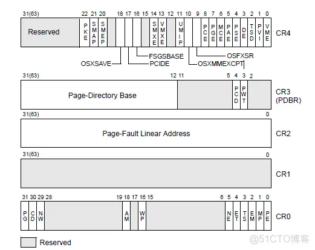
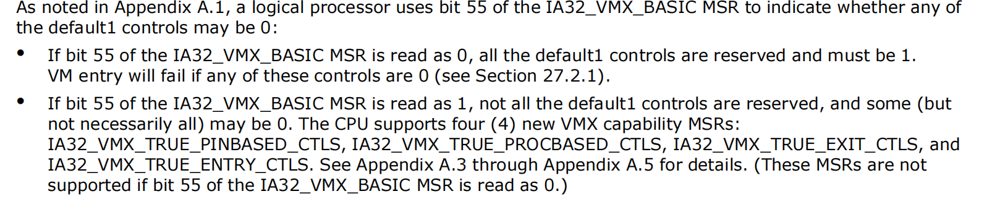
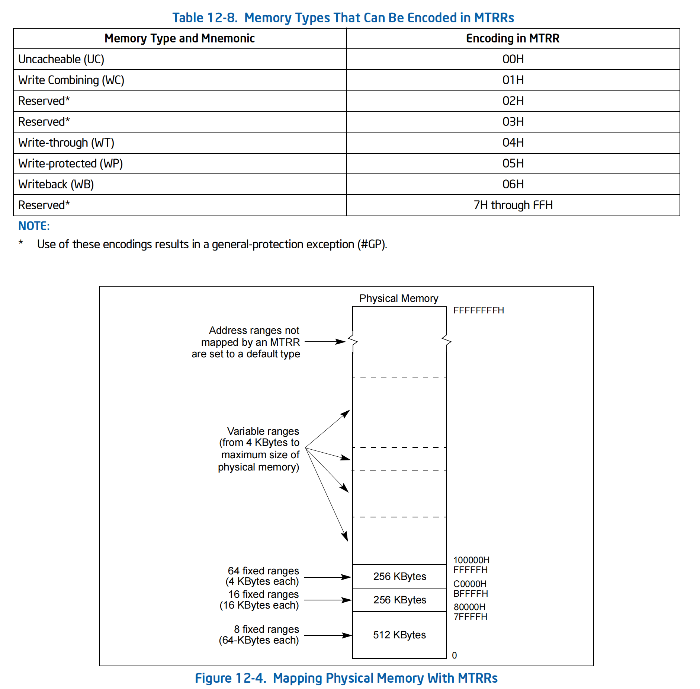
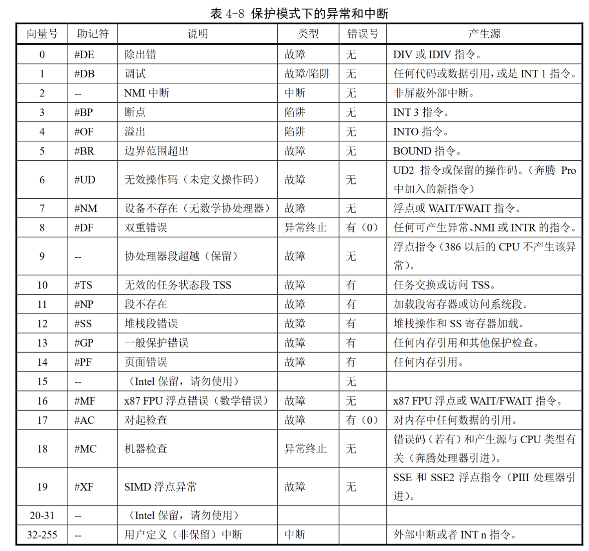
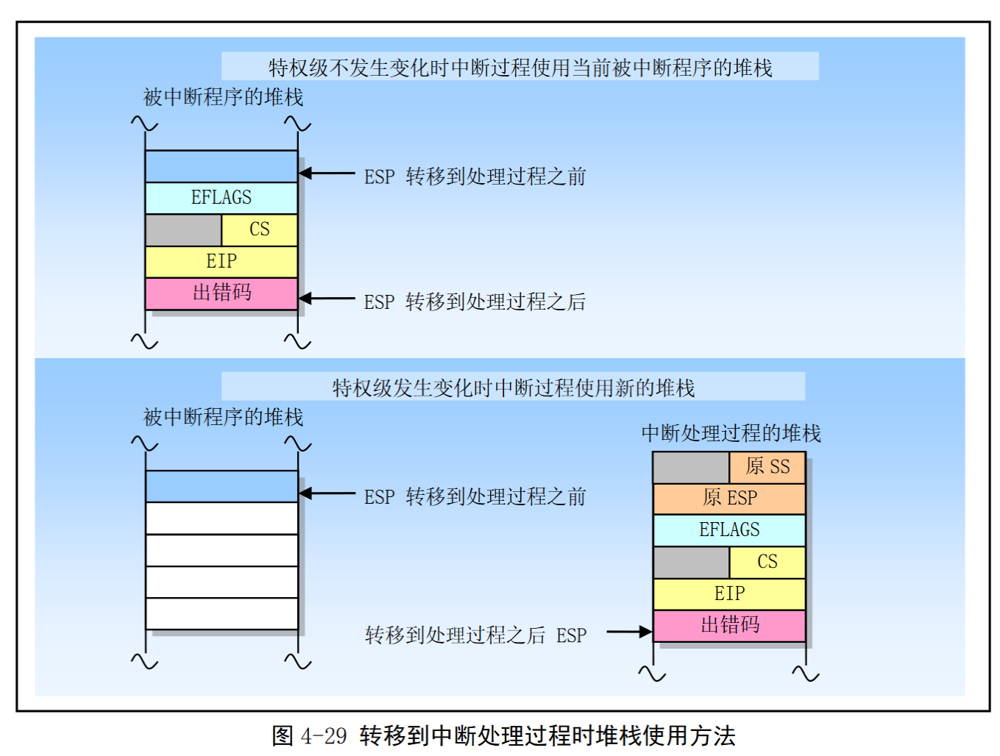

* [Hypervisor From Scratch](https://rayanfam.com/tags/hypervisor/) 不能迷信这个教程，有好多错误
* [Linux内核API](https://deepinout.com/linux-kernel-api)
* [VMX-osdev](https://wiki.osdev.org/VMX)
* [Intel® 64 and IA-32 Architectures Software Developer’s Manual Combined Volumes: 1, 2A, 2B, 2C, 2D, 3A, 3B, 3C, 3D, and 4](https://www.intel.com/content/www/us/en/developer/articles/technical/intel-sdm.html)
* [CPU Registers x86_64](https://wiki.osdev.org/CPU_Registers_x86-64)
* [VMCS-Auditor](https://github.com/SinaKarvandi/VMCS-Auditor)
* [Intel VT学习笔记](https://blog.csdn.net/qq_41988448/category_11624333.html)
* [RVM-tutorial](https://github.com/equation314/RVM-Tutorial)

## qemu安装虚拟机


### 安装虚拟机

```sh
qemu-img create -f qcow2 ubuntu-server-2204.qcow2 40G

export ISO=/home/wang/Documents/vms/ubuntu-22.04.1-live-server-amd64.iso
qemu-system-x86_64 -enable-kvm -m 2G -cpu host ubuntu-server-2204.qcow2 -cdrom $ISO
```

### 设置网络

```sh
sudo apt install -y bridge-utils        # 虚拟网桥工具
sudo apt install -y uml-utilities       # UML（User-mode linux）工具
sudo brctl addbr virbr0 #创建网桥
sudo brctl stp virbr0 on # 打开网桥stp
sudo systemctl enable libvirtd # 开机自动启动网桥
sudo dhclient virbr0 # 网桥自动获取IP


sudo ip tuntap add name virbr0-nic mode tap # 添加虚拟网卡，名为virbr0-nic
sudo ip link set dev virbr0-nic up #  启动网卡
sudo brctl addif virbr0 virbr0-nic # 添加虚拟网卡到网桥

brctl show # 查看网桥信息

# 启动虚拟机，这里不是创建，仅仅是启动虚拟机
qemu-system-x86_64 -enable-kvm -m 2G -cpu host \
    -netdev tap,id=mynet0,ifname=virbr0-nic,script=no,downscript=no  \
    -device e1000,netdev=mynet0\
    ubuntu-server-2204.qcow2
```

* [ubuntu下qemu虚拟机实现和主机以及互联网通信](https://blog.csdn.net/qq_34160841/article/details/104901127)

### 设置共享文件夹

https://libvirt.org/kbase/virtiofs.html

### ubuntu server autologin

```sh
sudo vim /etc/systemd/system/getty.target.wants/getty@tty1.service 

[Service] 
ExecStart= 
ExecStart=-/sbin/agetty --noissue --autologin myusername %I $TERM Type=idle
```

### Linux内核调试
```
CONFIG_GDB_SCRIPTS=y
CONFIG_DEBUG_INFO_REDUCED=n
CONFIG_RANDOMIZE_BASE=n
CONFIG_DEBUG_INFO_BTF=n
CONFIG_SYSTEM_TRUSTED_KEYS=""
CONFIG_SYSTEM_BLACKLIST_HASH_LIST=""
CONFIG_SYSTEM_REVOCATION_KEYS=""

# 使能kdb
CONFIG_DEBUG_INFO=y
CONFIG_FRAME_POINTER=y
CONFIG_MAGIC_SYSRQ=y
CONFIG_MAGIC_SYSRQ_SERIAL=y
CONFIG_KGDB_SERIAL_CONSOLE=y
CONFIG_KGDB_KDB=y
CONFIG_KGDB=y
```

在模块加载时进行调试的一种方法是使用printk()函数来输出调试信息，然后通过dmesg命令来查看这些信息1。你可以在模块的初始化函数中添加printk()语句，然后使用insmod命令来加载模块，再使用dmesg命令来查看输出。

另一种方法是使用kdb或kgdb来对模块进行断点、单步等操作，你需要在编译内核时开启CONFIG_KGDB和CONFIG_KDB选项，并设置相应的调试端口或网络接口，然后在加载模块时使用modprobe -v命令来显示详细信息，并在需要调试的地方添加KDB_ENTER()或KGDB_BREAKPOINT()宏，就可以进入调试器界面。

sudo modprobe -v <模块名>安装模块
sudo modprobe -r <模块名>卸载模块

modprobe相比insmod可以在出错的时候打印信息。

使用kgdb调试内核模块的方法是结合gdb一起使用，通过串口线或者网络连接两台机器，一台作为被调试机，运行内核模块，另一台作为调试机，运行gdb。具体步骤如下:

在被调试机上编译内核时，需要开启CONFIG_KGDB和CONFIG_KGDB_SERIAL_CONSOLE选项，并指定串口号和波特率。
在被调试机上加载内核模块时，需要加上kgdbwait参数，让内核进入等待状态。
在调试机上运行gdb，并指定内核符号表文件和内核模块文件。
在调试机上使用target remote命令连接被调试机的串口，并设置断点、单步执行等操作。

* [VirtualBox上调试Linux Kernel](http://pwn4.fun/2017/07/01/VirtualBox%E4%B8%8A%E8%B0%83%E8%AF%95Linux-Kernel/)
* [gdb-kernel-debugging](https://github.com/mz1999/blog/blob/master/docs/gdb-kernel-debugging.md)
* [Recompile kernel without modules that are not currently in use](https://unix.stackexchange.com/questions/218834/recompile-kernel-without-modules-that-are-not-currently-in-use)
* [Debugging the Linux kernel using the GDB](https://wiki.stmicroelectronics.cn/stm32mpu/wiki/Debugging_the_Linux_kernel_using_the_GDB) 这个写的很详细
* [linux内核调试（七）使用kdb/kgdb调试内核](https://zhuanlan.zhihu.com/p/546416941)
* [Linux kernel deb包的构建过程分析并简单手动构建](http://1.15.103.40/post/5.html)

## difference between VMX region and VMCS region

The VMXON region and the VMCS region are two different memory regions that are used for VMX operation. VMXON stands for Virtual Machine Extensions On and VMCS stands for Virtual Machine Control Structure 1.

The VMXON region is created per logical processor and used by it to enable or disable VMX operation. It is a 4-KByte aligned region that contains some data that is not disclosed by Intel. The physical address of this region is used as an operand for the VMXON instruction 231.

The VMCS region is created for each guest virtual CPU (vCPU) and used by both the hypervisor and the processor to manage the state of the vCPU. It is also a 4-KByte aligned region that contains many fields that control various aspects of virtualization, such as guest state, host state, execution control, exit control, etc. The physical address of this region is used as an operand for the VMPTRLD instruction

## 寄存器

https://wiki.osdev.org/CPU_Registers_x86-64

https://en.wikipedia.org/wiki/Segment_descriptor
https://wiki.osdev.org/Segment_Selector
https://en.wikipedia.org/wiki/Global_Descriptor_Table

CS = Code Segment (used for IP)

DS = Data Segment (used for MOV)

ES = Destination Segment (used for MOVS, etc.)

SS = Stack Segment (used for SP)

[Control Register](https://en.wikipedia.org/wiki/Control_register)





## 错误

错误位在RFLAGS中

The operation sections also use the pseudo-functions VMsucceed, VMfail, VMfailInvalid, and VMfailValid. These 
pseudo-functions signal instruction success or failure by setting or clearing bits in RFLAGS and, in some cases, by 
writing the VM-instruction error field. The following pseudocode fragments detail these functions:

VMsucceed:
    CF := 0;
    PF := 0;
    AF := 0;
    ZF := 0;
    SF := 0;
    OF := 0;

VMfail(ErrorNumber):
    IF VMCS pointer is valid
    THEN VMfailValid(ErrorNumber);
    ELSE VMfailInvalid;
    FI;

VMfailInvalid:
    CF := 1;
    PF := 0;
    AF := 0;
    ZF := 0;
    SF := 0;
    OF := 0;

VMfailValid(ErrorNumber):// executed only if there is a current VMCS
    CF := 0;
    PF := 0;
    AF := 0;
    ZF := 1;
    SF := 0;
    OF := 0;

Set the VM-instruction error field to ErrorNumber;
The different VM-instruction error numbers are enumerated in Section 31.4, “VM Instruction Error Numbers”.

### vmread读出的错误码

vmread读出的错误码如果bits:31被设置了，则bits15:0表示的是VM-ENTRY时的错误，如果bits:31没有被设置则bits15:0表示的是VM-EXIT时的错误。

VOLUME3 APPENDIX C
VMX BASIC EXIT REASONS

### EXIT_QUALIFICATION
VOLUME3 

Table 28-1. Exit Qualification for Debug Exceptions
Table 28-2. Exit Qualification for Task Switches
Table 28-3. Exit Qualification for Control-Register Accesses
Table 28-4. Exit Qualification for MOV DR 
Table 28-5. Exit Qualification for I/O Instructions 
Table 28-6. Exit Qualification for APIC-Access VM Exits from Linear Accesses and Guest-Physical Accesses
Table 28-7. Exit Qualification for EPT Violations
Table 32-9. Exit Qualification for SMIs That Arrive Immediately After the Retirement of an I/O Instruction

## 汇编指令


system amd64是一种基于x86_64架构的系统，它有不同的函数调用约定（calling convention），用来规定函数参数如何传递、返回值如何保存、寄存器如何使用等。

其中，最常见的两种函数调用约定是：
* System V AMD64：这是Linux系统上广泛使用的一种调用约定，它规定前六个整数或指针参数分别放在RDI, RSI, RDX, RCX, R8, R9寄存器中，前八个浮点参数分别放在XMM0~XMM7寄存器中，多余的参数按顺序压入栈中。返回值如果是整数或指针，则放在RAX寄存器中；如果是浮点，则放在XMM0寄存器中；如果是结构体，则放在RAX和RDX寄存器中。
* Microsoft x64：这是Windows系统上统一使用的一种调用约定，它规定前四个整数或指针参数分别放在RCX, RDX, R8, R9寄存器中，前四个浮点参数分别放在XMM0~XMM3寄存器中，多余的参数按顺序压入栈中。返回值和System V AMD64相同。


* call：这是一个过程调用指令，它的作用是将返回地址（也就是call指令后面的指令地址）压入栈中，然后跳转到目标过程的起始地址执行。
* ret：这是一个过程返回指令，它的作用是将栈顶的返回地址弹出到EIP寄存器中，然后跳转到EIP指示的指令地址继续执行。
* leave：这是一个释放栈帧指令，它的作用是将EBP寄存器的值赋给ESP寄存器，然后将栈顶的值弹出到EBP寄存器中。这样就恢复了调用过程之前的栈帧状态。
* jmp：这是一个无条件跳转指令，它的作用是直接跳转到目标地址执行，不管之前有没有调用过程或者返回地址。

一般来说，在汇编语言中编写子程序时，会使用call和ret配合使用来实现过程调用和返回；而在子程序内部会使用push, pop, mov等指令来建立和释放局部变量所占用的栈空间；也可以使用leave来简化释放栈空间的操作；而jmp则主要用于实现循环、分支等控制流结构。

* [内联汇编](https://gcc.gnu.org/onlinedocs/gcc/Extended-Asm.html)
* [x86_64汇编之一：AT&T汇编语法](https://blog.csdn.net/qq_29328443/article/details/107242121)
* [x86_64汇编之四：函数调用、调用约定](https://blog.csdn.net/qq_29328443/article/details/107232025)
* [x86_64汇编之五：System V AMD64调用约定下的函数调用](https://blog.csdn.net/qq_29328443/article/details/107235138)
* [指令讲解网站，自己修改URL的后缀为对应指令即可](https://www.felixcloutier.com/x86/pushf:pushfd:pushfq)


### SETBE/SETNA

```
SETBE/SETNA - Set if Below or Equal / Set if Not Above (386+)

        Usage:  SETBE   dest
                SETNA   dest
        (unsigned, 386+)
        Modifies flags: none

        Sets the byte in the operand to 1 if the Carry Flag or the Zero
        Flag is set, otherwise sets the operand to 0.

                                 Clocks                 Size
        Operands         808x  286   386   486          Bytes

        reg8              -     -     4     3             3
        mem8              -     -     5     4             3
```

### CPUID

VOL2A See “CPUID—CPU Identification” in Chapter 3, “Instruction Set Reference, A-L,”

## VMX CAPABILITY REPORTING FACILITY

VOLUME3 APPENDIXA VMX CAPABILITY REPORTING FACILITY

通过MSR可以设置处理器支持哪些能力。在设置VMCS时，为了使hypervisor能够在拥有不同微架构的处理器上工作，就需要明细处理器支持哪些能力以避免未定义的行为和VM-ENTRY时的错误。

这些处理器功能被分为若干个MSR：pin-based VM-execution controls, primary processor-based VM-execution controls, VM-Entry Controls, VM-Exit Controls, secondary processor-based VM-execution controls

|VMCS field|MSR|说明|
|----|----|----|
|VM_ENTRY_CONTROLS|MSR_IA32_VMX_ENTRY_CTLS|VM-Entry Controls|
|VM_EXIT_CONTROLS|MSR_IA32_VMX_EXIT_CTLS|VM-Exit Controls|
|CPU_BASED_VM_EXEC_CONTROL|MSR_IA32_VMX_PROCBASED_CTLS|primary processor-based VM-execution controls|
|SECONDARY_VM_EXEC_CONTROL|MSR_IA32_VMX_PROCBASED_CTLS2|secondary processor-based VM-execution controls|
|PIN_BASED_VM_EXEC_CONTROL|MSR_IA32_VMX_PINBASED_CTLS|pin-based VM-execution controls|

在VMX中，有一些控制位是保留的，必须被设置为0或者1，这些控制位称之为默认设置（default setting）。每个控制位可以被分为三类：
1. Always-flexible
2. default0
3. default1




上表的几个MSR寄存器的bits31:0都是允许被置为0的。如果在对应的MSR中，第X位是1的话，那么一般VMCS控制域也应当在相应的位设置为1；如果MSR中是0的话，VMCS控制域允许被设置为0.

高32bit是允许被设置成1的，如果MSR的第Xbit被设置成1，那么相应的位也可以被设置成1；如果MSR中是0的话，那么必须设置成0.

这两条规则并不总是试用，具体如何设置应参见手册。

## MSR-Bitmap

volume3 25.6.9 MSR-Bitmap Address

It is not necessary to initialize fields that the logical processor will not use. (For example, it is not necessary to 
initialize the MSR-bitmap address if the “use MSR bitmaps” VM-execution control is 0.)

Table 25-6. Definitions of Primary Processor-Based VM-Execution Controls

bit28 is `use MSR-Bitmap`, 0 means `do not use MSR-Bitmap`

## VM-Exit handle

VOLUME3 26.1 INSTRUCTIONS THAT CAUSE VM EXITS


## gdb的使用

gdb 显示内存数据的格式是 x /nfu123，其中：

x 是 examine 的缩写，意思是检查。
n 表示要显示的内存单元的个数。
f 表示显示方式，可以是 x（十六进制）、d（十进制）、u（无符号整型）、o（八进制）、t（二进制）、a（十六进制地址）、i（指令地址）、c（字符）或 f（浮点数）。
u 表示单位，可以是 b（字节）、h（半字）、w（字）或 g（双字）。
例如，x /9db 0x00001fa4 表示从内存地址 0x00001fa4 开始读取 9 个字节，并以十进制格式显示


## MTRR

A frame buffer is a large piece of computer memory that stores pixel data for a raster display.


MTRR, or Memory-Type Range Registers are a group of x86 Model Specific Registers providing a way to control access and cacheability of physical memory regions. These were introduced in the Intel Pentium Pro (P6) processor, intended to extend and enhance the memory type information provided by page tables (i.e. the write-through and cache disable bits).

The set of registers is provided in two groups: 11 registers for 88 fixed ranges and a number of base-mask pairs for custom range configuration. The exact number of the latter can be known by reading the capabilities register.

Memory type range registers (MTRRs) are a set of processor supplementary capability control registers that provide system software with control of how accesses to memory ranges by the CPU are cached. It uses a set of programmable model-specific registers (MSRs) which are special registers provided by most modern CPUs. Possible access modes to memory ranges can be uncached, write-through, write-combining, write-protect, and write-back. In write-back mode, writes are written to the CPU's cache and the cache is marked dirty, so that its contents are written to memory later.



Keep in mind that caching policy for each region of RAM is defined by MTRRs for PHYSICAL regions and PAGE ATTRIBUTE TABLE (PAT) for virtual areas so that each page can use its own caching policy by configuring IA32_PAT MSR. This means that sometimes the caching policy specified in MTRR registers is ignored, and instead, a page-level cache policy is used.


* VOL3A chapter12
* VOL3A 12.11 MEMORY TYPE RANGE REGISTERS (MTRRS)
* [Page Attribute Table, PAT](https://en.wikipedia.org/wiki/Page_attribute_table)
* [Wikipedia MTRR](https://en.wikipedia.org/wiki/Memory_type_range_register)
* [OSDEV MTRR](https://wiki.osdev.org/MTRR)
* [MTRR是什么](https://blog.csdn.net/jiangwei0512/article/details/100798102)


## LINUX 内存

### 内存分配

Linux内核提供了多种API来分配连续的物理内存。一些常用的API有：

* kmalloc或kmem_cache_alloc系列，用于分配小块的内存。保证地址4KB对齐
* vmalloc或其衍生函数，用于分配大的虚拟连续的内存区域。
* alloc_pages或__get_free_pages，用于直接从页分配器请求页。保证地址4KB对齐
* cma_alloc或zs_malloc，用于使用更专门的分配器。
* dma_alloc_coherent或dma_alloc_attrs，用于分配DMA可访问的连续内存，它们都保证返回的指针是4KB对齐的。

kmalloc和vmalloc的区别有以下几点：

* kmalloc保证分配的内存在物理上是连续的，而vmalloc保证的是在虚拟地址空间上的连续，但是在物理上它们不要求连续。
* kmalloc分配的内存处于3GB～high_memory之间，而vmalloc分配的内存在high_memory之后。
* kmalloc分配的内存大小有限制，一般不能超过128KB，而vmalloc可以分配较大的内存空间。
* kmalloc比vmalloc要快。这主要是因为vmalloc为了把物理内存上不连续的页转换为虚拟地址空间上连续的页，必须专门建立页表项。

kmalloc与get_zeored_page的区别：
* Allocation size: kmalloc() can be used to allocate any size of memory, whereas get_zeroed_page() is used to allocate one page (usually 4 KB) of memory.
* Memory initialization: kmalloc() does not initialize the memory it allocates, while get_zeroed_page() initializes the memory to all zeroes.
* Memory location: kmalloc() can allocate memory from the kernel's "slab cache" or from the "buddy allocator". get_zeroed_page() always allocates memory from the buddy allocator.
* Memory type: kmalloc() and get_zeroed_page() allocate memory that is suitable for general-purpose use by the kernel. If you need memory with specific attributes (e.g., non-cacheable or write-combining), you may need to use a different memory allocation function.

EPT paging structure必须是物理连续的空间，因此坚决不能使用vmalloc分配内存。

Slab allocator VS Buddy allocator:

* Slab allocator is a memory management technique used in the Linux kernel to efficiently allocate and deallocate small objects of a fixed size. It works by dividing memory into small chunks, known as slabs, each of which is of a fixed size and can hold a specific type of object. When an object is allocated, it is taken from a pre-allocated slab of memory. When the object is freed, it is returned to the slab for later use. This helps to reduce fragmentation and improve performance, as it avoids the need for repeated allocations and deallocations of small objects.
* Buddy allocator, on the other hand, is a memory management technique used to allocate and deallocate large blocks of memory. It works by dividing memory into blocks of a power of two size, and keeping track of which blocks are free and which are in use. When a block of memory is allocated, it is split into two equal-sized buddies, and the process is repeated until a block of the desired size is obtained. When a block is freed, the allocator checks if its buddy is also free, and if so, the two buddies are combined into a larger block.

## EPT

EPT paging structure必须是物理连续的空间，因此坚决不能使用vmalloc分配内存。

* VOL3 29.3 THE EXTENDED PAGE TABLE MECHANISM (EPT)
* Section 29.3.1 gives an overview of EPT.
* Section 29.3.2 describes operation of EPT-based address translation.
* Section 29.3.3 discusses VM exits that may be caused by EPT.
* Section 29.3.7 describes interactions between EPT and memory typing.
* VOL3 Table 28-7. Exit Qualification for EPT Violations


## SMP


### 禁用抢占

`local_bh_disable` disables the processing of bottom halves (softirqs). Softirqs are processed on either, interrupt return path, or by the ksoftirqd-(per cpu)-thread that will be woken up if the system suffers of heavy softirq-load.

`preempt_disable` disables preemption, which means, that while a thread is executing inside a `preempt_disable` <-> `preemt_enable` scope, it will not be put to sleep by the scheduler. This means that, if the system-timer-interrupt occurs while the current thread is inside that scope, it might update the accouting tables of the scheduler, but it will not switch context to another thread. this includes the softirqd.

`local_irq_disable` or `local_irq_save` disable interrupts for the local cpu. this means that the local cpu will not react to any irqs, so it will not run any interrupt return paths and hence, cannot run softirqs there.

```cpp

#define get_cpu() ({ preempt_disable(); smp_processor_id(); })
#define smp_processor_id() raw_smp_processor_id()
#define put_cpu() preempt_enable()
```


## Event Injection

### 中断与异常

中断（Interrupt）和异常（Exception）是指明系统、处理器或当前执行程序（或任务）的某处出现一 个事件，该事件需要处理器进行处理。通常，这种事件会导致执行控制被强迫从当前运行程序转移到被称 为中断处理程序（interrupt handler）或异常处理程序（exception handler）的特殊软件函数或任务中。处理 器响应中断或异常所采取的行动被称为中断/异常服务（处理）。 

通常，中断发生在程序执行的随机时刻，以响应硬件发出的信号。系统硬件使用中断来处理外部事件， 例如要求为外部设备提供服务。当然，软件也能通过执行 INT n 指令产生中断。 

异常发生在处理器执行一条指令时，检测到一个出错条件时发生，例如被 0 除出错条件。处理器可以 检测到各种出错条件，包括违反保护机制、页错误以及机器内部错误。异常可以被细分为故障（faults）、陷阱（traps）和中止（aborts）。

一般情况下，可以认为中断都是异步的，异常都是同步的。特殊的是，INT n指令产生的中断是同步的。

外部中断通过处理器芯片上两个引脚（INTR 和 NMI（Non-maskable interupt））接收。当引脚 INTR 接收到外部发生的中断信 号时，处理器就会从系统总线上读取外部中段控制器（例如 8259A）提供的中断向量号。当引脚 NMI 接 收到信号时，就产生一个非屏蔽中断。它使用固定的中断向量号 2。任何通过处理器 INTR 引脚接收的外 部中断都被称为可屏蔽硬件中断，包括中断向量号 0 到 255。标志寄存器 EFLAGS 中的 IF 标志可用来屏 蔽所有这些硬件中断。

INT n 指令可用于在软件中模拟指定的异常，但有一个限制。如果 INT 指令中的操作数 n 是 80X86 异 常的向量号之一，那么处理器将为该向量号产生一个中断，该中断就会去执行与该向量有关的异常处理程 序。但是因为这实际上是一个中断，所以处理器并不会把一个错误号压入堆栈，即使硬件产生的该向量相 关的中断通常会产生一个错误码。对于那些会产生错误码的异常，异常的处理程序会试图从堆栈上弹出错 误码。因此，如果使用 INT 指令来模拟产生一个异常，处理程序则会把 EIP（正好处于缺少的错误码位置 处）弹出堆栈，从而会造成返回位置错误。




#### 异常分类
* fault是一种通常可以被纠正的异常，并且一旦被纠正程序就可以继续运行。当出现一个 Fault， 处理器会把机器状态恢复到产生 Fault 的指令之前的状态。此时异常处理程序的返回地址会指向 产生 Fault 的指令，而不是其后面一条指令。因此在返回后产生 Fault 的指令将被重新执行。
* Trap 是一个引起陷阱的指令被执行后立刻会报告的异常。Trap 也能够让程序或任务连贯地执行。 Trap 处理程序的返回地址指向引起陷阱指令的随后一条指令，因此在返回后会执行下一条指令。
* Abort 是一种不会总是报告导致异常的指令的精确位置的异常，并且不允许导致异常的程序重新 继续执行。Abort 用于报告严重错误，例如硬件错误以及系统表中存在不一致性或非法值。

#### 异常与中断处理



### IRQ

An IRQ is an interrupt request from a device. Currently they can come in over a pin, or over a packet. Several devices may be connected to the same pin thus sharing an IRQ.

An IRQ number is a kernel identifier used to talk about a hardware interrupt source. Typically this is an index into the global irq_desc array, but except for what linux/interrupt.h implements the details are architecture specific.

An IRQ number is an enumeration of the possible interrupt sources on a machine. Typically what is enumerated is the number of input pins on all of the interrupt controller in the system. In the case of ISA what is enumerated are the 16 input pins on the two i8259 interrupt controllers.

Architectures can assign additional meaning to the IRQ numbers, and are encouraged to in the case where there is any manual configuration of the hardware involved. The ISA IRQs are a classic example of assigning this kind of additional meaning.


```cpp
typedef union _INTERRUPT_INFO {
    // VOL3 25.8.3 VM-Entry Controls for Event Injection
	struct {
		u32 Vector : 8;
		/* 0=Ext Int, 1=Rsvd, 2=NMI, 3=Exception, 4=Soft INT,
		 * 5=Priv Soft Trap, 6=Unpriv Soft Trap, 7=Other */
		u32 InterruptType : 3;
		u32 DeliverErrorCode : 1;  /* 0=Do not deliver, 1=Deliver */
		u32 Reserved : 19;
		u32 Valid : 1;         /* 0=Not valid, 1=Valid. Must be checked first */
	};
	u32 Flags;
} INTERRUPT_INFO, * PINTERRUPT_INFO;
```

The interruption type (bits 10:8) determines details of how the injection is performed. In general, a VMM 
should use the type hardware exception for all exceptions other than the following:
* breakpoint exceptions (#BP; a VMM should use the type software exception);
* overflow exceptions (#OF a VMM should use the use type software exception); and
* those debug exceptions (#DB) that are generated by INT1 (a VMM should use the use type privileged 
software exception).2


### Monitor Trap Flag(MTF)

Monitor Trap Flag (MTF) is a flag specifically designed for single-stepping in x86/Intel hardware virtualization VT-x technology. When MTF is set, the guest will trigger a VM Exit after executing each instruction (need to consider NMI or other interrupt delivery boundary). This paper presents an idea to use MTF for memory write allowing when monitoring modification to guest virtual-to-physical mapping (page table entries) tables. 


### 参考文献

* VOL1 6.5.1 Call and Return Operation for Interrupt or Exception Handling Procedures
* [Interrupts linux labs](https://linux-kernel-labs.github.io/refs/heads/master/lectures/interrupts.html)
* 25.8.3 VM-Entry Controls for Event Injection
* VOL3 27.6 EVENT INJECTION
* [Double fault wikipedia](https://en.wikipedia.org/wiki/Double_fault)
* linux内核完全注释 4.6 中断和异常处理
* VOL3 25.9.2 Information for VM Exits Due to Vectored Events
* [Monitor Trap Flag (MTF) Usage in EPT-based Guest Physical Memory Monitoring](http://hypervsir.blogspot.com/2014/11/monitor-trap-flag-mtf-usage-in-ept.html)
* VOL3 26.5.2 Monitor Trap Flag